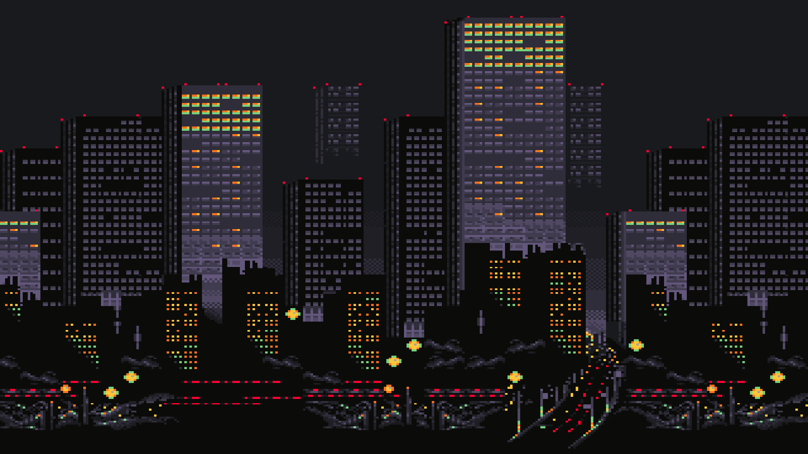

# Stain

## Selectively shift Hue, Saturation and Lightness values of pixels in a PNG, using filters. 

For example, to select pixels with saturation values between 0 and 40, and then shift their hues by 230, their lightness by -10 and saturation by 5:

```console
shoenot@computer:~$ ./stain.py pixel_buildings.png -fs 0 40 -sh 230 -sl -10 -ss 5
Created new image
```
Before:


After:


All options:
```
  -fh, --filter_h lower_limit upper_limit
  -fs, --filter_s lower_limit upper_limit
  -fl, --filter_l lower_limit upper_limit
  -sh, --shift_h shift_h
  -ss, --shift_s shift_s
  -sl, --shift_l shift_l
  -o, --output output_path
```

---
This program includes my [fork](https://github.com/shoenot/hasel) of [hasel](https://github.com/sumartoyo/hasel), originally released by sumartoyo under the MIT license, which allows for modifications and redistribution. The original license is included in this repository.
